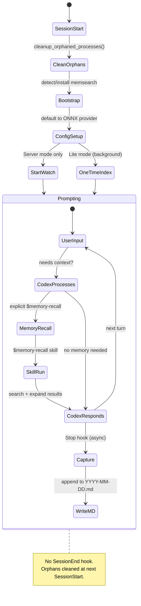
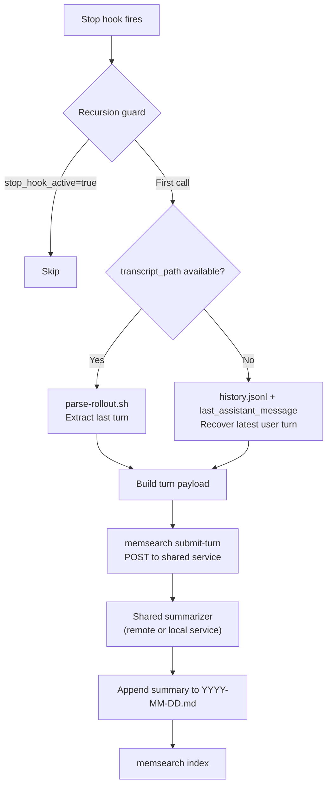

# How It Works

## What Happens Automatically

| Event | What memsearch does |
|-------|-------------------|
| **Session starts** | Clean up orphaned processes, start watch (Server) or one-time index (Lite), write session heading, check for updates |
| **Each prompt** | No injected hint; memory recall stays explicit |
| **Each turn ends** | The captured turn is submitted to the centralized summary service and the returned summary is saved to daily `.md` |

---

## Hook Architecture

The Codex plugin uses 3 shell hooks (Codex does not have a `SessionEnd` hook):

| Hook | Type | Async | Timeout | What It Does |
|------|------|-------|---------|-------------|
| **SessionStart** | command | no | 30s | Cleanup orphans, bootstrap memsearch, start watch/index, write session heading |
| **Stop** | command | no | 30s | Parse the last turn, submit it to the shared summary service, append the returned summary, and index the updated memory file |

### Hook Lifecycle



---

## SessionStart -- Bootstrap and Maintain

The SessionStart hook handles several Codex-specific concerns:

1. **Orphan cleanup** -- since Codex has no `SessionEnd` hook, orphaned `memsearch watch` and `memsearch index` processes from previous sessions are cleaned up here. Also sweeps orphaned `milvus_lite` processes.

2. **Bootstrap** -- if `memsearch` is not found in PATH, the hook auto-installs `uv` and warms up the `uvx` cache with `memsearch[onnx]`.

3. **Config setup** -- defaults to `onnx` provider if no config file exists (no API key needed).

4. **Watch vs. one-time index** -- detects the Milvus backend:
    - **Server mode** (`http://` or `tcp://` URI): starts `memsearch watch` as a persistent background process via `setsid`
    - **Lite mode** (local `.db` file): runs a one-time `memsearch index` in a background subshell (watch would fail due to Milvus Lite's file lock)

5. **Update check** -- queries PyPI (2s timeout) and shows update banner if newer version exists.

### Milvus Lite Lock Handling

Milvus Lite uses a file-level lock that prevents concurrent access. This means `memsearch watch` (which runs continuously) would block `memsearch search` (which runs on-demand). The plugin handles this by:

- **Not starting watch in Lite mode** -- the SessionStart hook detects the URI format and skips `start_watch()` for non-HTTP/TCP URIs
- **Skipping re-index in Stop hook for Lite mode** -- the Stop hook only runs `memsearch index` when using a Server backend
- **One-time index at session start** -- a single background index run at SessionStart ensures existing memories are searchable
- **Dimension mismatch auto-recovery** -- if indexing fails with "dimension mismatch" (e.g., after switching embedding providers), the hook auto-resets and re-indexes

For real-time indexing without lock issues, use [Milvus Server or Zilliz Cloud](../../getting-started.md#milvus-backends).

---

## Stop Hook -- Capture

The Stop hook is the capture entrypoint. It turns the current Codex turn into a JSON payload, submits that payload to the shared `memsearch serve` service, appends the returned summary to the daily memory file, and re-indexes the updated markdown.



### Payload Compatibility

Current Codex builds do **not** reliably provide `transcript_path` in the Stop hook payload. On current CLI builds the hook receives `session_id`, `turn_id`, `cwd`, `model`, `permission_mode`, `stop_hook_active`, and `last_assistant_message`, while `transcript_path` may be `null`.

The plugin handles both cases:

- If `transcript_path` exists, it parses the rollout with `parse-rollout.sh` and keeps the richer rollout anchor for L3 drill-down.
- If `transcript_path` is missing, it falls back to the latest matching user prompt in `~/.codex/history.jsonl` plus `last_assistant_message`.

The central service owns the actual summarization model and prompt. The hook only needs the captured turn text and metadata.

---

## hooks.json Format

Codex CLI uses a `hooks.json` file (at `~/.codex/hooks.json`) to define hook scripts. The installer updates the nested `hooks` object, replacing only older memsearch Codex entries and preserving unrelated hooks:

```json
{
  "hooks": {
    "SessionStart": [
      {
        "matcher": "",
        "hooks": [
          {
            "type": "command",
            "command": "bash /path/to/plugins/codex/hooks/session-start.sh",
            "timeout": 30
          }
        ]
      }
    ],
    "Stop": [
      {
        "matcher": "",
        "hooks": [
          {
            "type": "command",
            "command": "bash /path/to/plugins/codex/hooks/stop.sh",
            "timeout": 30
          }
        ]
      }
    ]
  }
}
```

!!! note "Installer behavior"
    The installer updates the nested `hooks` object in `~/.codex/hooks.json`, replacing only older memsearch Codex hook entries and preserving unrelated hooks.

---

## Memory Files

```
your-project/.memsearch/memory/
├── 2026-03-24.md
├── 2026-03-25.md
└── 2026-03-26.md
```

### Example Memory File

```markdown
# 2026-03-25

## Session 10:30

### 10:30
<!-- session:abc123 rollout:~/.codex/sessions/abc123.rollout.jsonl -->
- User asked about database migration strategy for the new preferences feature
- Codex implemented Alembic migration for new user_preferences table with 4 columns
- Added rollback script and tested migration on staging database
- Created index on user_id column for query performance

### 11:15
<!-- session:abc123 rollout:~/.codex/sessions/abc123.rollout.jsonl -->
- User asked to add validation for the preferences API endpoint
- Codex added pydantic models for request/response validation
- Implemented custom validators for preference value types
- Added unit tests covering edge cases (empty values, invalid types)

## Session 15:00

### 15:00
<!-- session:def456 rollout:~/.codex/sessions/def456.rollout.jsonl -->
- User reported 500 error when saving preferences with Unicode characters
- Codex traced issue to missing UTF-8 encoding in the SQLAlchemy column definition
- Fixed by adding `String(collation='utf8mb4_unicode_ci')` to the model
- Added regression test with emoji and CJK characters
```

When the `rollout:` anchor is populated, the memory-recall skill can use `parse-rollout.sh` for L3 drill-down. On current Codex builds the Stop payload may omit `transcript_path`, so some memories keep only the `session:` anchor plus the summarized bullets.

---

## Differences from Claude Code Plugin

| Aspect | Codex Plugin | Claude Code Plugin |
|--------|-------------|-------------------|
| **SessionEnd hook** | Not available -- orphans cleaned at next SessionStart | Available -- clean shutdown |
| **Summarizer** | `memsearch serve` (shared service) | `claude -p --model haiku` |
| **Recursion prevention** | Not needed for summarization | `stop_hook_active` flag + `CLAUDECODE=` |
| **Skill context** | Main context (no `context: fork`) | Forked subagent (`context: fork`) |
| **Milvus Lite** | One-time index + skip re-index in Stop | Same approach via `start_watch()` logic |
| **Auto-install** | Bootstrap installs `uv` if missing | Requires pre-installed memsearch |
| **hooks.json** | Installer updates only memsearch Codex hook entries and preserves unrelated hooks | Part of plugin manifest |

---

## Plugin Files

```
plugins/codex/
├── hooks/
│   ├── common.sh                   # Shared setup: JSON helpers, process management, orphan cleanup
│   ├── session-start.sh            # SessionStart: bootstrap, watch/index, flush queued summaries
│   ├── stop.sh                     # Stop: capture turn, submit to shared summary service
├── skills/
│   └── memory-recall/
│       └── SKILL.md                # Memory recall skill ($memory-recall)
└── scripts/
    ├── derive-collection.sh        # Per-project collection name
    ├── install.sh                  # One-click installer (skill, hooks.json, feature flag)
    └── parse-rollout.sh            # Codex rollout JSONL parser for L3 drill-down
```

| File | Purpose |
|------|---------|
| `common.sh` | Shared library sourced by all hooks. Includes JSON helpers (`_json_val`, `_json_encode_str`), memsearch detection, watch/index singleton management, and `cleanup_orphaned_processes()` for Codex's missing SessionEnd. |
| `session-start.sh` | Bootstrap memsearch, start watch (Server) or one-time index (Lite), write session heading, flush queued summaries, check for updates. |
| `stop.sh` | Capture turn metadata and transcript text, submit to the shared summary service, append the returned summary to the daily memory file, and re-index the updated markdown. |
| `SKILL.md` | Memory recall skill with `__INSTALL_DIR__` placeholder (resolved at install time). Includes direct file read fallback for L2 in case `memsearch expand` hits sandbox restrictions. |
| `install.sh` | One-click installer: checks/installs memsearch, copies the skill, installs or updates memsearch hook entries in `hooks.json`, and enables the experimental hooks feature flag. |
| `parse-rollout.sh` | Parses Codex rollout JSONL files, extracting the last user message through EOF with role labels. |
