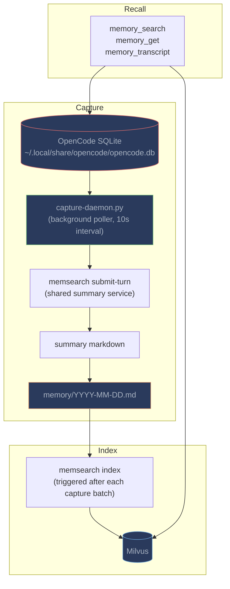
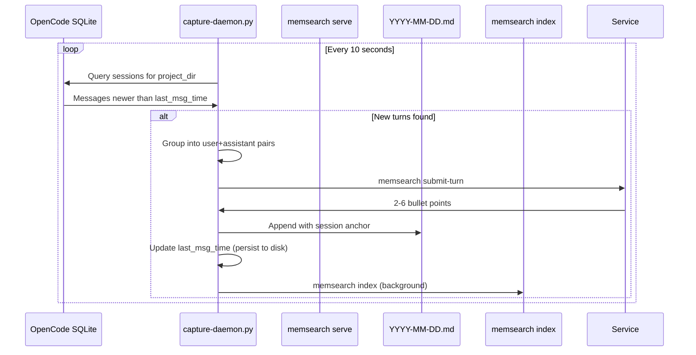

# How It Works

## What Happens Automatically

| Event | What memsearch does |
|-------|-------------------|
| **Plugin loads** | Detects memsearch CLI, derives collection name, ensures default ONNX config |
| **Session starts** | Starts capture daemon and runs initial index |
| **Conversation continues** | Capture daemon polls SQLite for new turns, submits them to `memsearch serve`, saves the returned summary to `.md`, re-indexes |
| **LLM needs history** | Calls `memory_search`, `memory_get`, or `memory_transcript` tools |

---

## Architecture



---

## Capture Daemon

Unlike Claude Code and Codex (which use hook-based capture), OpenCode uses a **background Python daemon** (`capture-daemon.py`). This design choice exists because OpenCode's plugin hooks don't support the kind of external capture that Claude Code's `Stop` hook enables -- there's no hook that fires after each response with access to the conversation transcript.

### Why a Daemon?

OpenCode stores all conversations in a SQLite database (`~/.local/share/opencode/opencode.db`). The daemon polls this database directly, which means:

- **No hook limitations** -- capture works regardless of which hooks OpenCode exposes
- **Reliable detection** -- new turns are detected by tracking `last_msg_time`, not by fragile event timing
- **Crash resilience** -- state is persisted to `.memsearch/.last_msg_time`, so daemon restarts don't re-capture old turns

### Daemon Flow



Step by step:

1. **Poll SQLite** -- queries the `session` and `message` tables for the current project directory, looking for messages newer than `last_msg_time`
2. **Group into turns** -- pairs consecutive `user` + `assistant` messages into turns
3. **Extract text** -- reads message `parts` (text content, tool calls with names/paths) into a readable format
4. **Summarize** -- calls `memsearch submit-turn` with the turn payload so the shared service performs the LLM work once for all clients
5. **Write to memory** -- appends the returned summary to `.memsearch/memory/YYYY-MM-DD.md` with `<!-- session:ID db:PATH -->` anchors
6. **Persist state** -- writes `last_msg_time` to `.memsearch/.last_msg_time` so restarts don't re-capture
7. **Re-index** -- triggers `memsearch index` in the background

### Daemon Self-Management

- **PID file** -- `.memsearch/.capture.pid` ensures only one daemon runs per project
- **Stale PID cleanup** -- on startup, the plugin checks if the PID is still alive; dead PIDs are cleaned up
- **Signal handling** -- daemon cleans up its PID file on SIGTERM/SIGINT
- **Auto-start** -- the TypeScript plugin starts the daemon on plugin load and on each tool invocation (ensuring it's running even after a crash)

---

## Memory Files

```
your-project/.memsearch/memory/
├── 2026-03-25.md
├── 2026-03-26.md
└── 2026-03-27.md
```

### Example Memory File

```markdown
# 2026-03-26

## Session 14:30

### 14:30
<!-- session:ses_abc123 db:~/.local/share/opencode/opencode.db -->
- User asked about authentication flow in the Express API
- OpenCode explained the OAuth2 implementation in auth.ts
- OpenCode modified token refresh logic in refresh.ts to handle expired tokens
- Added error handling for revoked refresh tokens

### 15:15
<!-- session:ses_abc123 db:~/.local/share/opencode/opencode.db -->
- User reported 500 error on /api/users endpoint
- OpenCode traced the issue to a missing null check in userController.ts
- OpenCode added optional chaining and a 404 response for missing users
- [Tool: bash `npm test`] — all tests pass

## Session 17:00

### 17:00
<!-- session:ses_def456 db:~/.local/share/opencode/opencode.db -->
- User asked to refactor the middleware chain for better error handling
- OpenCode created a centralized error handler in middleware/errorHandler.ts
- Removed try/catch blocks from individual route handlers
- Added structured error logging with request ID correlation
```

The `<!-- session:... db:~/.local/share/opencode/opencode.db -->` anchors are used by the `memory_transcript` tool to query the original conversation from OpenCode's SQLite database.

---

## Differences from Other Plugins

| Aspect | OpenCode | Claude Code | OpenClaw | Codex |
|--------|----------|-------------|----------|-------|
| **Capture** | SQLite daemon (polling) | Stop hook (event-driven) | agent_end hook (event-driven) | Stop hook (event-driven) |
| **Summarizer** | `memsearch serve` (shared service) | `claude -p --model haiku` | `openclaw agent --local` | `memsearch serve` (shared service) |
| **L3 source** | OpenCode SQLite DB | Claude Code JSONL | OpenClaw JSONL | Codex rollout JSONL |
| **Recall trigger** | Tool-based (LLM decides) | Skill in forked subagent (`context: fork`) | Tool-based (LLM decides) | Skill-based (main context) |
| **Install** | npm + opencode.json | Plugin marketplace | `openclaw plugins install` | `install.sh` + hooks.json |
| **Recursion prevention** | XDG_CONFIG_HOME isolation | `CLAUDECODE=` env var | `MEMSEARCH_NO_WATCH` flag | Isolated CODEX_HOME |

---

## Plugin Files

```
plugins/opencode/
├── package.json                    # npm package with @opencode-ai/plugin peer dep
├── index.ts                        # Main plugin: tools, hooks, daemon management
├── install.sh                      # Installation script
├── skills/
│   └── memory-recall/
│       └── SKILL.md                # Memory recall skill
└── scripts/
    ├── derive-collection.sh        # Per-project collection name
    ├── capture-daemon.py           # Background SQLite poller + summarizer
    └── parse-transcript.py         # SQLite session reader for L3 drill-down
```

| File | Purpose |
|------|---------|
| `index.ts` | Main plugin. Registers 3 tools and daemon lifecycle management |
| `capture-daemon.py` | Background Python daemon. Polls OpenCode's SQLite, submits turns to the shared summary service, writes to daily `.md`, triggers re-indexing |
| `parse-transcript.py` | SQLite session reader for L3 drill-down. Reads original messages from OpenCode's database by session ID |
| `derive-collection.sh` | Generates deterministic per-project Milvus collection names from project paths |
| `install.sh` | Installation script: symlinks plugin, copies skill to `~/.agents/skills/`, installs dependencies |
